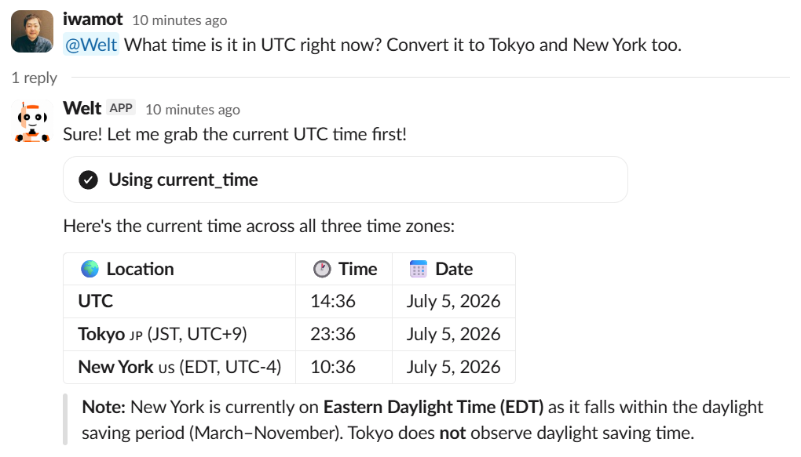

# Welt

[](https://github.com/iwamot/welt/pkgs/container/welt)

**A Slack frontend for AI agents on Amazon Bedrock AgentCore.**



Welt is a deployable Slack app that forwards conversations to your agent on AgentCore (your own code on AgentCore Runtime, or a managed harness) and streams the reply back into the Slack thread. You focus on the agent — model, tools, MCP, memory — and Welt takes care of the Slack side: tokens, event intake, history fetch, and streaming rendering.

## Quick Start

### 1. Deploy an Agent

Deploy your agent to AgentCore Runtime and note its ARN. [`examples/agent/`](examples/agent/) is a working example to start from. If you'd rather not write agent code, a managed harness ARN works here too.

### 2. Create a Slack App

- Go to <https://api.slack.com/apps> and create a new Slack app from [`manifest.yml`](manifest.yml).
- In **Basic Information > App-Level Tokens**, generate a token with the `connections:write` scope and copy it (`xapp-1-...`).
- In **Install App**, install the app to your workspace and copy the **Bot User OAuth Token** (`xoxb-...`).

### 3. Create a `.env` File

Save your Slack tokens and agent ARN in a `.env` file ([`.env.sample`](.env.sample) lists all supported variables):

```sh
SLACK_APP_TOKEN=xapp-1-...
SLACK_BOT_TOKEN=xoxb-...
AGENT_ARN=arn:aws:bedrock-agentcore:...
```

For AWS credentials, any standard boto3 configuration works: best is an IAM role assumed from the environment Welt runs in (EC2, ECS, ...), and access keys in `.env` work too. Either way, the identity needs permission to invoke your agent.

### 4. Run Welt Container

```sh
docker run -it --env-file .env ghcr.io/iwamot/welt:latest
```

### 5. Say Hello!

Invite the bot to a channel (`/invite @Welt`) and mention it, or send it a DM. Welt streams the agent's reply into the thread, showing tool use as it happens.

## Running on AWS Lambda

Instead of the resident container, Welt also runs on AWS Lambda: `lambda_function.py` serves the same conversation flow on the Lambda Python runtime.

1. Package the function:

   ```sh
   uv export --frozen --no-dev --no-emit-project > requirements-lambda.txt
   pip install -r requirements-lambda.txt -t package/
   cp -r app lambda_function.py package/
   (cd package && zip -r ../welt-lambda.zip .)
   ```

2. Create a function with the latest Python runtime, handler `lambda_function.lambda_handler`, and a timeout long enough for your agent's replies (execution is bounded by Lambda's 15-minute cap).
3. Set the environment variables: `SLACK_BOT_TOKEN`, `SLACK_SIGNING_SECRET` (**Basic Information > Signing Secret**), and `AGENT_ARN`.
4. Give the function's role permission to invoke your agent, plus `lambda:InvokeFunction` on the function itself (it re-invokes itself to reply after acking each event).
5. Create a Function URL (auth type `NONE`).
6. In the Slack app manifest, set `socket_mode_enabled: false` and add the URL as `settings.event_subscriptions.request_url`.

## Contributing

Contributions are welcome! Please see our [Contributing Guide](CONTRIBUTING.md) for details.

## Related Projects

- [iwamot/collmbo](https://github.com/iwamot/collmbo) - A Slack bot for chatting with 100+ LLMs directly — no AI agent to implement or deploy. Pick Collmbo for plain LLM chat, Welt for your own agent.

## License

MIT
