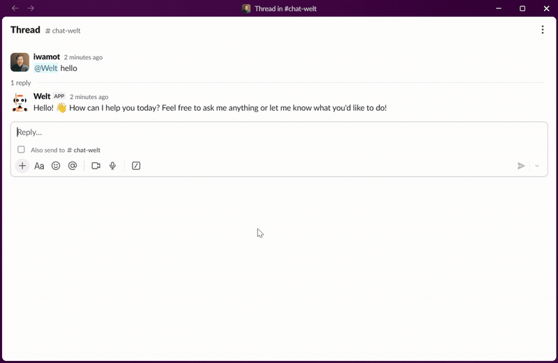

# Welt

[](https://github.com/iwamot/welt/pkgs/container/welt)

**A Slack frontend for AI agents on Amazon Bedrock AgentCore.**



Welt forwards conversations to your agent on AgentCore and streams the reply back into the Slack thread.

You focus on the agent — model, tools, MCP, memory. Welt handles the Slack side — tokens, event intake, history fetch, streaming rendering, and uploading the files your agent generates.

The pieces line up like this:

```
Slack ⇄ Welt ⇄ AgentCore Runtime
                └── your agent, using an adapter for Welt's JSON wire
```

Adapters exist for Strands Agents (Python and TypeScript) and Mastra (TypeScript), and more may follow — see [Agent-Side Adapters](#agent-side-adapters). The Quick Start below runs welt-io-strands's example agent.

## Quick Start

The Quick Start runs everything on your machine — Welt in one terminal, the example agent in another. Nothing is deployed; the only AWS dependency is the Bedrock model the agent calls. Deployment comes after, once the conversation works — see [Deploy the Agent to AgentCore](#deploy-the-agent-to-agentcore).

### 1. Create a Slack App

- Go to <https://api.slack.com/apps> and create a new Slack app from [`manifest.yml`](manifest.yml).
- In **Basic Information > App-Level Tokens**, generate a token with the `connections:write` scope and copy it (`xapp-1-...`).
- In **Install App**, install the app to your workspace and copy the **Bot User OAuth Token** (`xoxb-...`).

### 2. Get the Code and Create a `.env` File

Clone this repository:

```sh
git clone https://github.com/iwamot/welt.git
cd welt
```

Then save your Slack tokens in a `.env` file at the repository root ([`.env.sample`](.env.sample) lists all supported variables):

```sh
SLACK_APP_TOKEN=xapp-1-...
SLACK_BOT_TOKEN=xoxb-...
```

With no `AGENT_ARN` set, Welt runs in local mode: it forwards conversations to the agent at `http://localhost:8080`.

### 3. Run Welt

Run Welt with [uv](https://docs.astral.sh/uv/):

```sh
uv run --env-file .env main.py
```

It connects to Slack and waits. In local mode Welt itself needs no AWS credentials — the agent process is the one calling AWS.

### 4. Run the Example Agent

In another terminal, run [welt-io-strands's example agent](https://github.com/iwamot/welt-io-strands/tree/main/examples/agent) by following its README's **Run Locally** section; it serves on `http://localhost:8080`, where Welt is pointing. (Prefer TypeScript? The [welt-io-strands-ts](https://github.com/iwamot/welt-io-strands-ts/tree/main/examples/agent) and [welt-io-mastra](https://github.com/iwamot/welt-io-mastra/tree/main/examples/agent) example agents work just as well here.)

### 5. Say Hello!

Invite the bot to a channel (`/invite @Welt`) and mention it, or send it a DM. Welt streams the agent's reply into the thread; the example agent's README suggests things to try.

## Deploy the Agent to AgentCore

When the local loop works, move the agent to AgentCore Runtime: deploy it by following the example's README (its **Deploy** section), then point `AGENT_ARN` at the agent runtime ARN from the deploy output and restart Welt:

```sh
AGENT_ARN=arn:aws:bedrock-agentcore:...
```

Welt now picks up your AWS credentials the standard SDK way — environment variables, `AWS_PROFILE`, an SSO session — and the identity needs two actions on the agent runtime ARN: `bedrock-agentcore:InvokeAgentRuntime`, and `bedrock-agentcore:InvokeAgentRuntimeForUser` because Welt sends the verified Slack user as the [`runtimeUserId`](docs/wire.md#session-and-identity).

Once you're comfortable, swap in your own agent and point `AGENT_ARN` at its deployment — see [Agent-Side Adapters](#agent-side-adapters) below.

## Features

- [Files](docs/files.md) — file input from Slack uploads, and uploading the files your agent generates back into the thread.
- [Interrupts](docs/interrupts.md) — human-in-the-loop: a tool (or hook) that interrupts pauses the run and becomes buttons or a text field in the thread; the answer resumes it.

## Agent-Side Adapters

The wire between Welt and the agent is plain JSON, and the [Wire Contract](docs/wire.md) is its full specification. Each adapter maps the wire to one framework's types and carries its own example agent:

| Repository | Language | Framework | Package |
| --- | --- | --- | --- |
| [welt-io-strands](https://github.com/iwamot/welt-io-strands) | Python | Strands Agents | [welt-io-strands](https://pypi.org/project/welt-io-strands/) |
| [welt-io-strands-ts](https://github.com/iwamot/welt-io-strands-ts) | TypeScript | Strands Agents | [@welt-io/strands](https://www.npmjs.com/package/@welt-io/strands) |
| [welt-io-mastra](https://github.com/iwamot/welt-io-mastra) | TypeScript | Mastra | [@welt-io/mastra](https://www.npmjs.com/package/@welt-io/mastra) |

Other stacks can implement the contract directly.

## Configuration

Optional environment variables, all with working defaults:

| Variable | Default | Description |
|----------|---------|-------------|
| `AGENT_ARN` | (unset) | The AgentCore Runtime agent — or managed harness — to invoke. Unset is local mode, for development: Welt invokes the agent at `http://localhost:8080` instead. |
| `AGENT_MANAGES_HISTORY` | `false` | What Welt sends per turn: the full thread history (`false`), or only the new messages (`true`). |
| `FILE_INPUT_MODALITIES` | (unset) | Comma-separated modalities to accept from Slack uploads; unset disables file input. See [Files](docs/files.md). |
| `LOG_LEVEL` | `INFO` | Logging level for Welt's own loggers. |
| `DEPS_LOG_LEVEL` | `INFO` | Logging level for dependency libraries (botocore, slack_bolt, ...). Separate from `LOG_LEVEL` because botocore logs credential material at `DEBUG`. |
| `SLACK_STREAM_BUFFER_SIZE` | `256` | Markdown characters buffered before each streaming update; larger values mean fewer Slack API calls. |

## Other Ways to Run

- Running the container image — the same Socket Mode process, packaged as [`ghcr.io/iwamot/welt`](https://github.com/iwamot/welt/pkgs/container/welt) for hosting on AWS. Supply the same variables as the `.env` file through the hosting environment (an ECS task definition, ...) and let its IAM role provide the AWS credentials:

  ```sh
  docker run -it \
    -e SLACK_APP_TOKEN=xapp-1-... \
    -e SLACK_BOT_TOKEN=xoxb-... \
    -e AGENT_ARN=arn:aws:bedrock-agentcore:... \
    ghcr.io/iwamot/welt:latest
  ```
- [Running Welt on AWS Lambda](docs/lambda.md) — serve Welt on Lambda instead of a resident process: no always-on process, no cost while idle.
- [Chatting with an AgentCore harness](docs/harness.md) — point `AGENT_ARN` at a managed harness instead of your own agent code.

## Contributing

Contributions are welcome! Please see our [Contributing Guide](CONTRIBUTING.md) for details.

## Related Projects

- [iwamot/collmbo](https://github.com/iwamot/collmbo) — A Slack bot for chatting with 100+ LLMs directly, no AI agent to implement or deploy. Pick Collmbo for plain LLM chat, Welt for your own agent.

## License

MIT
