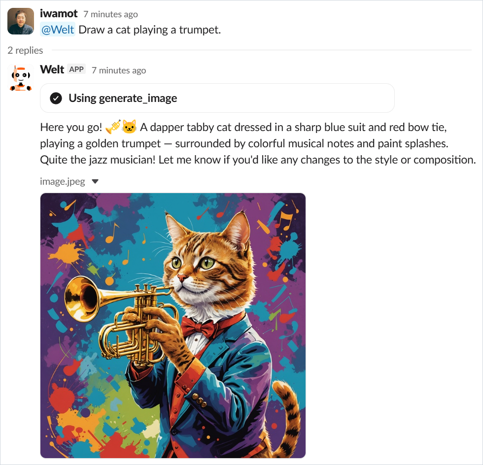

# Files

Welt supports file input and output: what people upload to the Slack thread reaches the agent as part of the conversation, and what the agent generates is uploaded back into the thread.

## Input: Slack uploads to the agent

Disabled by default. Set `FILE_INPUT_MODALITIES` to the modalities to accept:

```sh
FILE_INPUT_MODALITIES=image,document,video
```

Allow only the modalities your model accepts — see [supported foundation models](https://docs.aws.amazon.com/bedrock/latest/userguide/model-cards.html).

Welt downloads the files attached to the thread and embeds them into the Converse-shaped `messages` as image/document/video blocks, newest first.

The contract: JSON cannot carry raw bytes, so each embedded block holds a base64 string in its `source.bytes` slot, and the agent side decodes it before the messages reach the model. An adapter such as [welt-io](https://github.com/iwamot/welt-io) handles the decoding — see its documentation.

The embedding stays within the Converse limits:

| Modality | Files per conversation | Per-file size |
|---|---|---|
| `image` | 20 | 3.75 MB |
| `document` | 5 | 4.5 MB |
| `video` | 1 | 18.75 MB |

## Output: agent files to the thread

The contract: a generated file is one `file` event on the reply stream —

```json
{"file": {"name": "chart.png", "bytes": "<base64>"}}
```

— where `name` is the upload filename (extension included) and `bytes` is the base64-encoded content. Welt uploads each one into the thread, where it appears alongside the streamed reply. An adapter emits these for you: with welt-io, the files a tool returns become `file` events automatically — see its documentation.



**Size limit**: a `file` event travels as one streamed chunk, and AgentCore Runtime caps a response chunk at 10 MB — going over kills the stream. With base64's 4/3 growth, the practical ceiling is roughly 7 MB of raw file. There is no slicing protocol — for anything bigger, have the agent put the file somewhere else (for example S3) and reply with a link instead.
