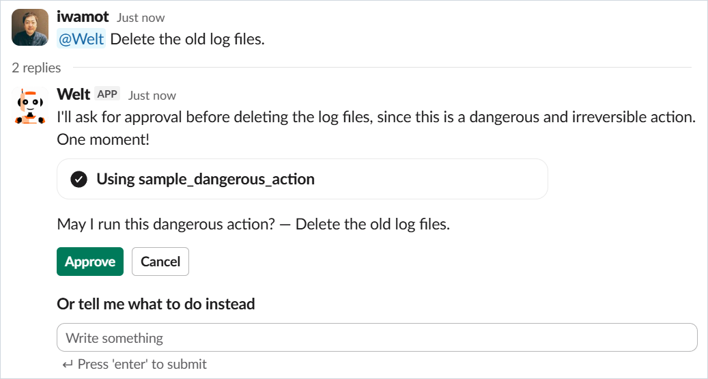
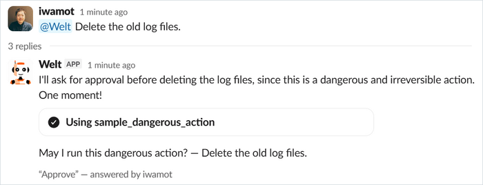

# Interrupts

Welt supports human-in-the-loop pauses: an agent run can stop mid-way to ask for decisions, and Welt renders each pending question as buttons and/or a free-text field in the Slack thread. Once every question is answered, Welt re-invokes the same session with the answers and the run continues where it stopped.

```
run stops with questions → Welt posts them in the thread
  → people answer (press a button, or type and hit Enter)
  → all answered → Welt re-invokes the session with the answers
  → the reply streams on as usual
```

Welt keeps no state of its own — the collection lives in the question message's metadata. The events and payloads are under [Wire contract](#wire-contract); an [agent-side adapter](../README.md#agent-side-adapters) does the wiring, and its documentation covers raising interrupts from agent code.

## The reason contract

Each question carries a `reason` — any JSON value — and Welt decides the rendering purely from its shape:

| Reason shape | Rendering |
|---|---|
| A structured shape below | `message` as the body, plus the specified buttons and/or text field |
| A string | That string as the body, default widgets |
| Anything else | Pretty-printed JSON in a code block, default widgets |

A structured reason carries `message` plus `options` (choice buttons), `input` (a free-text field), or both — buttons with a free-text alternative:

```json
{
  "message": "Deploy to prod?",
  "options": [
    {"value": "approve", "label": "Deploy", "style": "primary"},
    {"value": "reject", "label": "Cancel"}
  ]
}
```

```json
{
  "message": "Which city should I check?",
  "input": {"label": "City"}
}
```

- `message` — required, non-empty string.
- `options` — non-empty list (at most 25, one Slack actions block). Each option:
  - `value` — required, non-empty string, at most 1800 characters (it must fit a Slack button value together with the question's id). Returned as the answer when its button is pressed.
  - `label` — optional string; the button text (clipped to Slack's 75-character button limit). Defaults to `value`.
  - `style` — optional; `"primary"` or `"danger"` only.
- `input` — a dict with optional `label` (the field's label, defaults to `"Answer"`) and `multiline` (defaults to `false`). The typed text, submitted with Enter, becomes the answer.

With both, the buttons render above the field, and whichever answer comes first settles the question — all of its widgets retire into the receipt together.



Matching is all-or-nothing: one malformed field (or any unknown key) drops the whole reason to the fallback rendering — no partial repair. The shapes are frozen at these fields; emoji, confirm dialogs, URLs and the like are beyond Welt's abstraction and will not be added.

The default widgets are the `y` (**Approve**, primary) and `n` (**Deny**) buttons plus a free-text field, so any question stays answerable whatever its reason looks like. The button values are `y` / `n` because common approval evaluators (such as the default one of Strands' HumanInTheLoop) understand them without configuration.

Bodies longer than Slack's 3000-character section limit are clipped with an ellipsis. Fallback renderings guarantee only that the pause is visible and answerable; if you care how it looks, use the structured shape.

## Behavior details

- **Who can answer**: anyone who can see the thread — the trust boundary is channel membership. The answered question's widgets are replaced with a context-line receipt — `“answer” — answered by name` — carrying the button's label or the submitted text.

  
- **Multiple questions**: one stop can carry several. Welt renders them all in one message and resumes only after every one is answered — there is no partial resume. A resumed run may stop again; the round trip just repeats.
- **Double answers**: an answered question loses its widgets, so it cannot be answered twice. A duplicate that slips in before the widgets retire (a double press, or a double Enter in the text field) resumes nothing and puts the resume notice under the questions; the first answer's reply still arrives. Answers landing at the same instant on different questions can rarely lose one; its widgets stay visible, so just answer again.
- **Expiry**: Welt sets no deadline — an answer always just attempts the resume, and when the run can no longer continue, a notice appears under the questions. How long a run stays resumable is between the agent and its runtime.
- **Notifications**: the question message carries a fixed plain-text summary that notifications and screen readers show in place of the blocks.

## Wire contract

Outbound, a stream that pauses for input ends with one `interrupt` event per pending question:

```json
{"interrupt": {"id": "<question id>", "name": "<interrupt name>", "reason": "any JSON value"}}
```

- `id` identifies the question when resuming.
- `name` goes to Welt's log only; the rendering comes from the reason.
- `reason` drives the rendering, per [the reason contract](#the-reason-contract).

Inbound, the resume payload replaces `messages` with `interrupt_responses` — the two envelope keys are mutually exclusive, and `"messages" in payload` / `"interrupt_responses" in payload` is the discriminator:

```json
{
  "interrupt_responses": {
    "<id from the interrupt event>": "<the answer>"
  }
}
```

A plain mapping of question id to the chosen or typed answer, deliberately framework-neutral: turning it into the framework's own resume input is the adapter's job (welt-io does it for Strands Agents, welt-io-mastra for Mastra).

## Limitations

- **MCP elicitation is not supported.** Do not register an elicitation callback when your agent acts as an MCP client — there is no response path on the wire, and the tool call would hang. This can be revisited once Welt has a bidirectional streaming transport or MCP's multi-round-trip requests are settled and common.
- Approve-with-edits and resume across sessions are out of scope for now.
- Expiry is optimistic only (see [Behavior details](#behavior-details)); there is no guarantee of how long answers stay acceptable.
- Rendering quality is only guaranteed for the structured reason shape; fallbacks guarantee just the visible, answerable pause.
