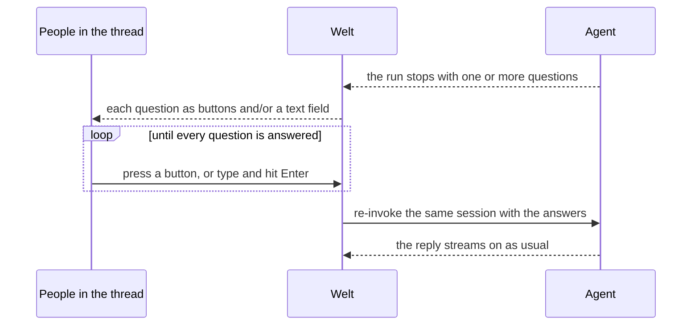
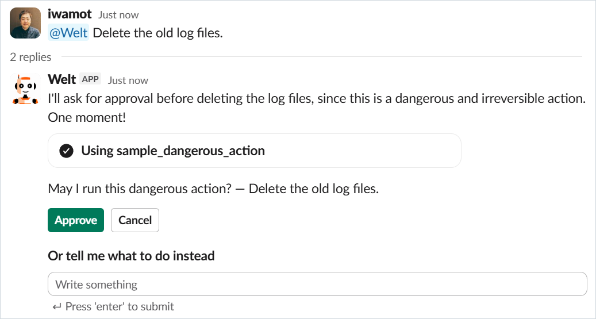
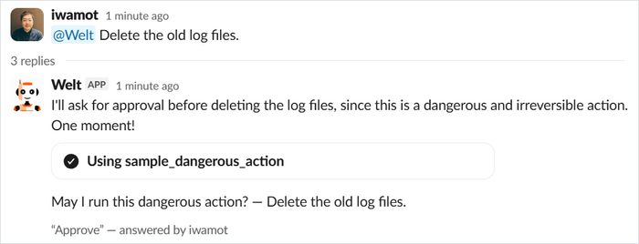

# Interrupts

Welt supports human-in-the-loop pauses: an agent run can stop mid-way to ask for decisions, and Welt renders each pending question as buttons and/or a free-text field in the Slack thread. Once every question is answered, Welt re-invokes the same session with the answers and the run continues where it stopped.


```mermaid
sequenceDiagram
    participant P as People in the thread
    participant W as Welt
    participant A as Agent

    A-->>W: the run stops with one or more questions
    W-->>P: each question as buttons and/or a text field
    loop until every question is answered
        P->>W: press a button, or type and hit Enter
    end
    W->>A: re-invoke the same session with the answers
    A-->>W: the reply streams on as usual
```

Welt keeps no state of its own — the collection lives in the question message's metadata. The events and payloads are specified in the [wire contract](wire.md#interrupt); an [agent-side adapter](../README.md#agent-side-adapters) does the wiring, and its documentation covers raising interrupts from agent code.

## How a question renders

Each question carries a `reason` — any JSON value — and Welt decides the rendering purely from its shape:

| Reason shape | Rendering |
|---|---|
| The [structured shape](wire.md#interrupt) | `message` as the body, plus the specified buttons and/or text field |
| A string | That string as the body |
| Anything else | Pretty-printed JSON in a code block |

A question that declared no widget of its own gets the default **Approve** / **Reject** buttons, so every question can be answered however its reason was written.

A structured reason carries `message` plus `options` (choice buttons), `input` (a free-text field), both — buttons with a free-text alternative — or neither, which renders the message as itself and leaves the answering to the default buttons. The [wire contract](wire.md#interrupt) defines every field; the shapes look like this:

```json
{
  "message": "Deploy to prod?",
  "options": [
    {"value": "approve", "label": "Deploy", "style": "primary"},
    {"value": "reject", "label": "Cancel"}
  ]
}
```

```json
{
  "message": "Which city should I check?",
  "input": {"label": "City"}
}
```

With both, the buttons render above the field, and whichever answer comes first settles the question — all of its widgets retire into the receipt together.



Matching is all-or-nothing: a reason that misses the structured shape in any way falls back to the default rendering — no partial repair.

The default buttons answer with `true` (**Approve**, primary) and `false` (**Reject**, danger), and they are the only default — no other widget renders unasked. The values are booleans because a question reaches these buttons precisely when nothing declared what to send back, which usually means the code reading the answer is code the agent's author did not write: Strands' steering annotates the response `bool` and tests it for truthiness, and the default evaluator of its HumanInTheLoop intervention accepts `true` as approval. Deliberately no free-text field: a field the question never asked for would accept answers the asking side never offered (a typed `y` would read as approval to an evaluator, with no hint on screen that it means anything). A question that wants free text asks for it with the structured reason's `input`.

An option declares whatever value its own agent reads, and a string is often the clearest one — `{"value": "Approve"}` labels the button and answers with the same word. The defaults are booleans because they answer on behalf of a question that declared nothing, not because booleans are the preferred way to write an option.

An answer also carries the widget it came from, so a question offering both never has to guess whether a word was pressed or typed. The [wire contract](wire.md#interrupt_responses--resuming-a-run) has the shape.

Bodies — the structured `message` and the plain-string reason — render as standard Markdown, the same interpretation as the streamed reply text, so an agent formats a question the way it formats everything else. A stop's bodies share Slack's 12,000-character markdown budget, split evenly and clipped with an ellipsis. Fallback renderings guarantee only that the pause is visible and answerable; if you care how it looks, use the structured shape.

## Behavior details

- **Who can answer**: anyone who can see the thread — the trust boundary is channel membership. The answered question's widgets are replaced with a context-line receipt — `“answer” — answered by name` — carrying the button's label or the submitted text.

  
- **Multiple questions**: one stop can carry several. Welt renders them all in one message and resumes only after every one is answered — there is no partial resume. A resumed run may stop again; the round trip just repeats.
- **Double answers**: an answered question loses its widgets, so it cannot be answered twice. A duplicate that slips in before the widgets retire (a double press, or a double Enter in the text field) resumes nothing and puts the resume notice under the questions; the first answer's reply still arrives. Answers landing at the same instant on different questions can rarely lose one; its widgets stay visible, so just answer again.
- **Expiry**: Welt sets no deadline — an answer always just attempts the resume, and when the run can no longer continue, a notice appears under the questions. How long a run stays resumable is between the agent and its runtime.
- **Notifications**: the question message carries a fixed plain-text summary that notifications and screen readers show in place of the blocks.

## Limitations

- **MCP elicitation is not supported.** Do not register an elicitation callback when your agent acts as an MCP client — there is no response path on the wire, and the tool call would hang.
- Expiry is optimistic only (see [Behavior details](#behavior-details)); there is no guarantee of how long answers stay acceptable.
- Rendering quality is only guaranteed for the structured reason shape; fallbacks guarantee just the visible, answerable pause.
